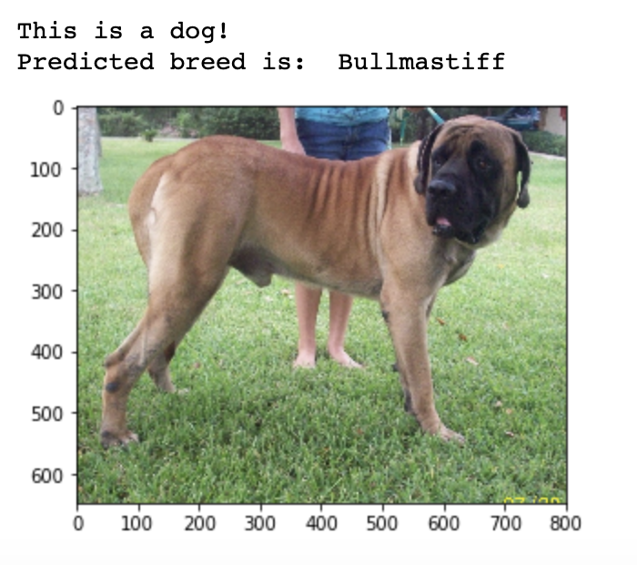
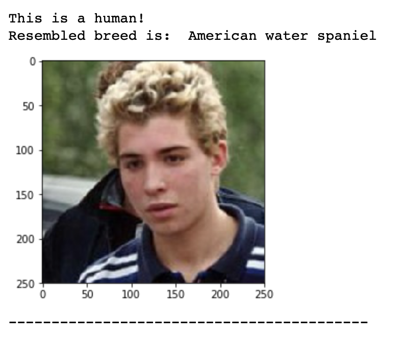

# Dog Breed Classifier using CNN
## Udacity DLND

### Project Overview

In this project, Convolutional Neural Networks (CNN) will be used to build a pipeline to process real-world, user-supplied images. Given an image of a dog, your algorithm will identify an estimate of the canine’s breed. If supplied an image of a human, the code will identify the resembling dog breed.

### Results

